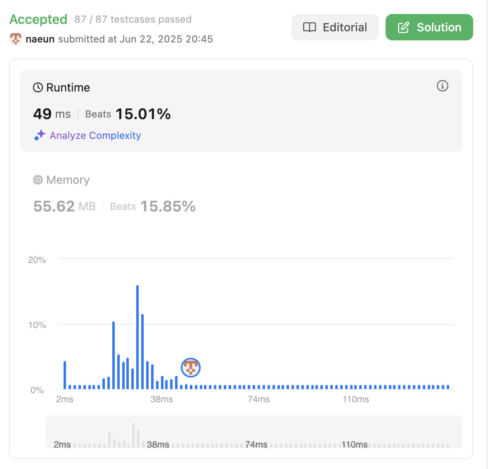
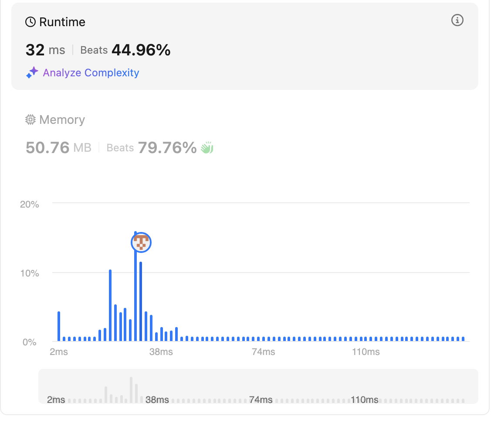

- [question](https://leetcode.com/problems/k-closest-points-to-origin/)

# Solution
## Complexity
- 
- Time: O(NlogN)
- Space: O(N)
## Code
```java
class Solution {
    public int[][] kClosest(int[][] points, int k) {
        // priority queue
        // (value, index)
        // pop until kth.

        PriorityQueue<ValueIndex> pq = new PriorityQueue<>(Comparator.comparing(ValueIndex :: getValue));

        for(int i = 0; i < points.length; i++){
            int[] p = points[i];
            double value = Math.pow(p[0],2) + Math.pow(p[1],2);
            pq.add(new ValueIndex(value, i));
        }

        List<int[]> result = new ArrayList<>();
        for(int c = 0; c < k; c++){
            ValueIndex target = pq.poll();
            result.add(points[target.getIndex()]);
        }

        int[][] answer = new int[result.size()][2];

        for(int i = 0; i < result.size(); i++){
            answer[i] = result.get(i);
        }

        return answer;
    }

    class ValueIndex{
        double value;
        int index;

        ValueIndex(double v, int idx){
            this.value = v;
            this.index = idx;
        }

        public double getValue(){
            return value;
        }

        public int getIndex(){
            return index;
        }
    }
}
```

# Review with GPT

- Time: O(NlogK)
- Space: O(N)

- reduce cost of making Object and only use K-sized heap.
```java
class Solution {
    public int[][] kClosest(int[][] points, int k) {
        // 최대 힙 (거리 기준으로 내림차순)
        PriorityQueue<int[]> maxHeap = new PriorityQueue<>(
            (a, b) -> Integer.compare(distance(b), distance(a))
        );

        for (int[] point : points) {
            maxHeap.offer(point);
            if (maxHeap.size() > k) {
                maxHeap.poll(); // 가장 먼 점 제거
            }
        }

        // 결과 배열로 변환
        int[][] result = new int[k][2];
        for (int i = 0; i < k; i++) {
            result[i] = maxHeap.poll();
        }

        return result;
    }

    // 제곱 거리만 비교하면 충분 (루트 안 씌워도 됨)
    private int distance(int[] p) {
        return p[0] * p[0] + p[1] * p[1];
    }
}

```